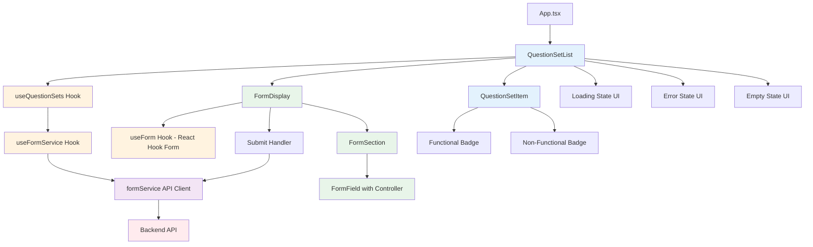

# Design Document

## Overview

The **Question Set List UI** feature is a React-based component that provides users with an interface to browse available question sets (forms) and retrieve detailed form content for completion. This feature serves as the entry point for the form-filling workflow within the newInstructionsUI microfrontend application. The design follows the existing microfrontend architecture pattern using Module Federation and leverages the shared design system for consistent UI styling.

The implementation consists of three main layers:
1. **Presentation Layer**: React components for displaying question sets and handling user interactions
2. **Service Layer**: Custom hooks and API client for form retrieval and data management
3. **Data Layer**: TypeScript interfaces and data validation for type safety

## Steering Document Alignment

### Technical Standards (tech.md)

The design adheres to the documented technical standards:

- **React 19.0.0 with Functional Components**: All components use functional components with React hooks (useState, useEffect, useMemo, useCallback) for state management
- **React Hook Form v7+**: Form state management, validation, and submission handling for the retrieved form data
- **TypeScript 5.9.2**: Strongly typed interfaces for all data structures, props, and API responses
- **Material UI v7.3.4**: Leverages MUI components (List, ListItem, Card, CircularProgress, Alert) for consistent UI patterns
- **@spec-kit-demo-v2/design-system**: Uses the shared design system for theming, typography, and component styling
- **Modular Architecture**: Single Responsibility Principle applied—separate components for list display, item rendering, form display, and data fetching
- **Error Handling**: Comprehensive error boundaries and user-friendly error messages
- **Performance**: React.memo for component optimization, proper dependency arrays in hooks

### Project Structure (structure.md)

The implementation follows the documented project structure conventions:

- **Component Files**: PascalCase naming (e.g., `QuestionSetList.tsx`, `QuestionSetItem.tsx`, `FormDisplay.tsx`)
- **Hooks**: camelCase with `use` prefix (e.g., `useQuestionSets.ts`, `useFormService.ts`, `useFormValidation.ts`)
- **Type Definitions**: Separate file for interfaces (`types.ts`)
- **Service Layer**: API client abstraction (`formService.ts`)
- **Test Files**: Co-located test files with `.spec.tsx` suffix
- **File Organization Pattern**:
  ```
  apps/newInstructionsUi/src/
  ├── app/
  │   ├── components/
  │   │   ├── QuestionSetList/
  │   │   │   ├── QuestionSetList.tsx
  │   │   │   ├── QuestionSetList.spec.tsx
  │   │   │   ├── QuestionSetItem.tsx
  │   │   │   ├── QuestionSetItem.spec.tsx
  │   │   │   └── index.ts
  │   │   ├── FormDisplay/
  │   │   │   ├── FormDisplay.tsx
  │   │   │   ├── FormDisplay.spec.tsx
  │   │   │   ├── FormSection.tsx
  │   │   │   ├── FormField.tsx
  │   │   │   └── index.ts
  │   ├── hooks/
  │   │   ├── useQuestionSets.ts
  │   │   ├── useQuestionSets.spec.ts
  │   │   ├── useFormService.ts
  │   │   ├── useFormService.spec.ts
  │   │   ├── useFormValidation.ts
  │   │   └── useFormValidation.spec.ts
  │   ├── services/
  │   │   ├── formService.ts
  │   │   └── formService.spec.ts
  │   ├── types/
  │   │   └── questionSet.types.ts
  ```

## Code Reuse Analysis

### Existing Components to Leverage

- **@spec-kit-demo-v2/design-system**: 
  - **MUI Components**: Box, Card, CardContent, Typography, List, ListItem, ListItemButton, CircularProgress, Alert, Chip, Stack, TextField, Select, Radio, Checkbox, Button
  - **Theme System**: lightTheme, darkTheme, AppTheme provider for consistent styling
  - **Typography**: Pre-configured typography variants (h4, h5, h6, body1, body2)
  - **Spacing & Breakpoints**: Consistent spacing scale and responsive breakpoints
  
- **React 19.0.0 Hooks**:
  - useState for component state management
  - useEffect for side effects (API calls)
  - useMemo for expensive computations and memoization
  - useCallback for function memoization to prevent unnecessary re-renders

- **React Hook Form v7+** (to be installed):
  - useForm hook for form state management
  - Controller component for controlled MUI inputs
  - Built-in validation and error handling
  - TypeScript support for type-safe forms

- **React Router v6.29.0/v7.9.4**:
  - useNavigate for programmatic navigation after form selection (future integration)

### Integration Points

- **Form Service API**: REST API endpoint for retrieving question set metadata and form details
  - Endpoint pattern: `/api/question-sets` (list), `/api/question-sets/:id` (detail)
  - Expected to return JSON responses
  - Authentication inherited from shell application via HTTP-only cookies or Authorization headers

- **Shell Application Integration**: 
  - The component will be exposed via Module Federation's remote-entry.ts
  - Wrapped in AppTheme provider to maintain theme consistency
  - Will receive authentication context from shell application

- **Future Form Display Component**:
  - QuestionSetList will pass selected form data to a FormDisplay component
  - FormDisplay will use React Hook Form for state management and validation
  - Data flow: QuestionSetList → FormDisplay (via props or React Context)
  - Form submission will POST data back to the form service API

### Missing Infrastructure to Build

Since the project doesn't have an established HTTP client library (no axios in dependencies) or React Hook Form, we'll need to:

- **Install React Hook Form**: Add `react-hook-form` package for form state management
  - Version: ^7.53.0 (latest stable)
  - Provides: useForm, Controller, FormProvider hooks
  - TypeScript support included
  
- **Fetch API Wrapper**: A lightweight abstraction over the native Fetch API with error handling, timeout support, and type safety

- **Custom Hooks for Data Fetching**: Reusable hooks that encapsulate loading states, error handling, and data caching patterns

- **Form Display Component**: Component that uses React Hook Form to render and manage the retrieved form data

## Architecture

The feature follows a **layered component architecture** with clear separation of concerns:



### Data Flow

1. **Component Mount**: QuestionSetList mounts and calls useQuestionSets hook
2. **Initial Load**: Hook fetches question set metadata from API
3. **State Management**: Hook manages loading, error, and data states
4. **Rendering**: Component renders list based on current state
5. **User Interaction**: User clicks on a question set item
6. **Form Retrieval**: useFormService hook fetches detailed form data
7. **Form Display**: FormDisplay component receives formData and initializes React Hook Form
8. **Form Initialization**: useForm hook:
   - Builds defaultValues from formData structure
   - Sets up validation rules based on field configurations
   - Initializes form state (pristine, no errors)
9. **User Input**: User fills out form fields
   - React Hook Form tracks field values via Controller components
   - Validation runs on blur (mode: 'onBlur')
   - Errors displayed inline via FormHelperText
10. **Form Submission**: User clicks submit
    - handleSubmit validates all fields
    - If valid: onSubmit callback called with form data
    - Form data POSTed to backend API
    - Success: form reset or navigation
    - Error: display error alert, keep form data

### Modular Design Principles

- **Single File Responsibility**: 
  - `QuestionSetList.tsx`: Container component managing list state and layout
  - `QuestionSetItem.tsx`: Presentational component for individual items
  - `useQuestionSets.ts`: Data fetching and state management logic
  - `useFormService.ts`: Form retrieval logic
  - `formService.ts`: API client abstraction
  - `types.ts`: Type definitions only

- **Component Isolation**: Components communicate via props, no tight coupling
- **Service Layer Separation**: API calls isolated in service layer, hooks abstract business logic
- **Utility Modularity**: Reusable utility functions (e.g., timeout wrapper, error parser) in separate files

## Components and Interfaces

### Component 1: QuestionSetList

- **Purpose**: Container component that displays a list of available question sets and manages selection state
- **File**: `apps/newInstructionsUi/src/app/components/QuestionSetList/QuestionSetList.tsx`
- **Props**:
  ```typescript
  interface QuestionSetListProps {
    onFormSelected?: (formData: FormData) => void; // Callback when form is successfully loaded
    onError?: (error: Error) => void; // Callback for error handling
  }
  ```
- **State**:
  ```typescript
  const [selectedId, setSelectedId] = useState<string | null>(null);
  const { questionSets, loading, error } = useQuestionSets();
  const { formData, loading: formLoading, error: formError, fetchForm } = useFormService();
  ```
- **Responsibilities**:
  - Render loading state (CircularProgress)
  - Render error state (Alert component)
  - Render empty state (Typography with helpful message)
  - Render list of question sets using QuestionSetItem
  - Handle item selection and trigger form fetch
  - Pass form data to parent component or navigate to form view
- **Dependencies**: useQuestionSets, useFormService, QuestionSetItem
- **Reuses**: Box, Typography, List, CircularProgress, Alert, Stack from design-system

### Component 2: QuestionSetItem

- **Purpose**: Presentational component that renders a single question set item with visual feedback
- **File**: `apps/newInstructionsUi/src/app/components/QuestionSetList/QuestionSetItem.tsx`
- **Props**:
  ```typescript
  interface QuestionSetItemProps {
    questionSet: QuestionSet;
    isSelected: boolean;
    isLoading: boolean;
    onSelect: (id: string) => void;
    disabled: boolean;
  }
  ```
- **Responsibilities**:
  - Display question set name
  - Display functional status badge (Chip component)
  - Show loading indicator when item is being fetched
  - Provide hover feedback
  - Handle click events
  - Disable interaction for non-functional items or during loading
- **Dependencies**: None (pure presentational component)
- **Reuses**: Card, CardContent, Typography, Chip, CircularProgress, ListItemButton from design-system

### Component 3: FormDisplay

- **Purpose**: Container component that renders and manages the selected form using React Hook Form
- **File**: `apps/newInstructionsUi/src/app/components/FormDisplay/FormDisplay.tsx`
- **Props**:
  ```typescript
  interface FormDisplayProps {
    formData: FormData;
    onSubmit: (data: Record<string, unknown>) => Promise<void>;
    onCancel: () => void;
  }
  ```
- **State**: Managed by React Hook Form's useForm hook
  ```typescript
  const { 
    control, 
    handleSubmit, 
    formState: { errors, isSubmitting, isDirty },
    reset,
    watch
  } = useForm({
    defaultValues: buildDefaultValues(formData),
    mode: 'onBlur',
    resolver: async (data) => validateFormData(data, formData.sections)
  });
  ```
- **Responsibilities**:
  - Initialize React Hook Form with form schema from formData
  - Render form sections using FormSection components
  - Handle form validation using built-in and custom validators
  - Display validation errors inline
  - Handle form submission with loading state
  - Provide cancel/reset functionality
  - Track form dirty state to warn about unsaved changes
- **Dependencies**: useForm (React Hook Form), FormSection, FormField
- **Reuses**: Box, Typography, Button, Alert, Stack from design-system

### Component 4: FormSection

- **Purpose**: Presentational component that renders a section of the form with its fields
- **File**: `apps/newInstructionsUi/src/app/components/FormDisplay/FormSection.tsx`
- **Props**:
  ```typescript
  interface FormSectionProps {
    section: FormSection;
    control: Control<any>;
    errors: FieldErrors;
  }
  ```
- **Responsibilities**:
  - Render section title and description
  - Map section fields to FormField components
  - Pass React Hook Form control to each field
  - Display section-level validation messages
- **Dependencies**: FormField
- **Reuses**: Box, Typography, Paper, Divider from design-system

### Component 5: FormField

- **Purpose**: Wrapper component that renders the appropriate MUI input based on field type using React Hook Form's Controller
- **File**: `apps/newInstructionsUi/src/app/components/FormDisplay/FormField.tsx`
- **Props**:
  ```typescript
  interface FormFieldProps {
    field: FormField;
    control: Control<any>;
    error?: FieldError;
  }
  ```
- **Responsibilities**:
  - Render appropriate MUI component based on field.type:
    - text/email/phone → TextField
    - textarea → TextField with multiline
    - number → TextField with type="number"
    - date → TextField with type="date"
    - select → Select
    - radio → RadioGroup
    - checkbox → Checkbox
    - file → Custom file input
  - Wrap input with Controller from React Hook Form
  - Display validation errors
  - Apply field-level validation rules
  - Handle required fields
- **Dependencies**: Controller from react-hook-form
- **Reuses**: TextField, Select, Radio, RadioGroup, Checkbox, FormControl, FormLabel, FormHelperText from design-system
- **Implementation Pattern**:
  ```typescript
  export function FormField({ field, control, error }: FormFieldProps) {
    return (
      <Controller
        name={field.id}
        control={control}
        rules={{
          required: field.required ? `${field.label} is required` : false,
          ...buildValidationRules(field.validation)
        }}
        render={({ field: { onChange, onBlur, value, ref } }) => {
          switch (field.type) {
            case 'text':
            case 'email':
            case 'phone':
              return (
                <TextField
                  label={field.label}
                  value={value || ''}
                  onChange={onChange}
                  onBlur={onBlur}
                  inputRef={ref}
                  error={!!error}
                  helperText={error?.message}
                  placeholder={field.placeholder}
                  required={field.required}
                  fullWidth
                />
              );
            case 'select':
              return (
                <FormControl fullWidth error={!!error}>
                  <InputLabel>{field.label}</InputLabel>
                  <Select
                    value={value || ''}
                    onChange={onChange}
                    onBlur={onBlur}
                    label={field.label}
                  >
                    {field.options?.map(opt => (
                      <MenuItem key={opt.value} value={opt.value} disabled={opt.disabled}>
                        {opt.label}
                      </MenuItem>
                    ))}
                  </Select>
                  {error && <FormHelperText>{error.message}</FormHelperText>}
                </FormControl>
              );
            // ... other field types
            default:
              return null;
          }
        }}
      />
    );
  }
  ```

### Hook 1: useQuestionSets

- **Purpose**: Custom hook for fetching and managing question set list data
- **File**: `apps/newInstructionsUi/src/app/hooks/useQuestionSets.ts`
- **Return Type**:
  ```typescript
  interface UseQuestionSetsReturn {
    questionSets: QuestionSet[];
    loading: boolean;
    error: Error | null;
    refetch: () => Promise<void>;
  }
  ```
- **Responsibilities**:
  - Fetch question sets on mount
  - Manage loading and error states
  - Provide refetch functionality
  - Cache data to prevent unnecessary re-fetches
- **Dependencies**: formService
- **Implementation Pattern**:
  ```typescript
  export function useQuestionSets(): UseQuestionSetsReturn {
    const [state, setState] = useState<{
      questionSets: QuestionSet[];
      loading: boolean;
      error: Error | null;
    }>({
      questionSets: [],
      loading: true,
      error: null,
    });

    const fetchQuestionSets = useCallback(async () => {
      setState(prev => ({ ...prev, loading: true, error: null }));
      try {
        const data = await formService.getQuestionSets();
        setState({ questionSets: data, loading: false, error: null });
      } catch (error) {
        setState(prev => ({ ...prev, loading: false, error: error as Error }));
      }
    }, []);

    useEffect(() => {
      fetchQuestionSets();
    }, [fetchQuestionSets]);

    return { ...state, refetch: fetchQuestionSets };
  }
  ```

### Hook 2: useFormService

- **Purpose**: Custom hook for fetching detailed form data for a selected question set
- **File**: `apps/newInstructionsUi/src/app/hooks/useFormService.ts`
- **Return Type**:
  ```typescript
  interface UseFormServiceReturn {
    formData: FormData | null;
    loading: boolean;
    error: Error | null;
    fetchForm: (questionSetId: string) => Promise<void>;
    reset: () => void;
  }
  ```
- **Responsibilities**:
  - Fetch form data on demand (not automatically)
  - Manage loading and error states
  - Prevent race conditions (cancel previous requests)
  - Provide reset functionality to clear state
- **Dependencies**: formService
- **Implementation Pattern**:
  ```typescript
  export function useFormService(): UseFormServiceReturn {
    const [state, setState] = useState<{
      formData: FormData | null;
      loading: boolean;
      error: Error | null;
    }>({
      formData: null,
      loading: false,
      error: null,
    });

    const abortControllerRef = useRef<AbortController | null>(null);

    const fetchForm = useCallback(async (questionSetId: string) => {
      // Cancel previous request if any
      if (abortControllerRef.current) {
        abortControllerRef.current.abort();
      }

      abortControllerRef.current = new AbortController();
      setState({ formData: null, loading: true, error: null });

      try {
        const data = await formService.getFormById(questionSetId, abortControllerRef.current.signal);
        setState({ formData: data, loading: false, error: null });
      } catch (error) {
        if (error.name !== 'AbortError') {
          setState({ formData: null, loading: false, error: error as Error });
        }
      }
    }, []);

    const reset = useCallback(() => {
      if (abortControllerRef.current) {
        abortControllerRef.current.abort();
      }
      setState({ formData: null, loading: false, error: null });
    }, []);

    return { ...state, fetchForm, reset };
  }
  ```

### Service: formService

- **Purpose**: API client for form-related HTTP requests
- **File**: `apps/newInstructionsUi/src/app/services/formService.ts`
- **Interfaces**:
  ```typescript
  interface FormServiceClient {
    getQuestionSets(): Promise<QuestionSet[]>;
    getFormById(id: string, signal?: AbortSignal): Promise<FormData>;
    submitFormData(formId: string, data: Record<string, unknown>): Promise<SubmissionResponse>;
  }
  ```
- **Responsibilities**:
  - Encapsulate all HTTP requests to form service API
  - Add authentication headers
  - Handle HTTP errors and transform to application errors
  - Implement timeout logic (30 seconds)
  - Parse and validate API responses
  - POST form submission data to backend
- **Dependencies**: Native Fetch API
- **Reuses**: None (lowest layer abstraction)
- **Implementation Pattern**:
  ```typescript
  const API_BASE_URL = process.env.NX_FORM_SERVICE_URL || '/api';
  const TIMEOUT_MS = 30000;

  class FormService implements FormServiceClient {
    private async fetchWithTimeout(url: string, options: RequestInit = {}): Promise<Response> {
      const controller = new AbortController();
      const timeoutId = setTimeout(() => controller.abort(), TIMEOUT_MS);
      
      try {
        const response = await fetch(url, {
          ...options,
          signal: options.signal || controller.signal,
          credentials: 'include', // Include cookies for auth
          headers: {
            'Content-Type': 'application/json',
            ...options.headers,
          },
        });
        
        if (!response.ok) {
          throw new Error(`HTTP ${response.status}: ${response.statusText}`);
        }
        
        return response;
      } finally {
        clearTimeout(timeoutId);
      }
    }

    async getQuestionSets(): Promise<QuestionSet[]> {
      const response = await this.fetchWithTimeout(`${API_BASE_URL}/question-sets`);
      const data = await response.json();
      return validateQuestionSets(data);
    }

    async getFormById(id: string, signal?: AbortSignal): Promise<FormData> {
      const response = await this.fetchWithTimeout(
        `${API_BASE_URL}/question-sets/${id}`,
        { signal }
      );
      const data = await response.json();
      return validateFormData(data);
    }

    async submitFormData(formId: string, data: Record<string, unknown>): Promise<SubmissionResponse> {
      const response = await this.fetchWithTimeout(
        `${API_BASE_URL}/question-sets/${formId}/submit`,
        {
          method: 'POST',
          body: JSON.stringify(data),
        }
      );
      const result = await response.json();
      return validateSubmissionResponse(result);
    }
  }

  export const formService = new FormService();
  ```

## Data Models

### QuestionSet

Represents metadata about an available question set/form.

```typescript
interface QuestionSet {
  id: string;                    // Unique identifier (UUID or numeric ID)
  name: string;                  // Display name (e.g., "Motor Claims Form Template")
  description?: string;          // Optional description of the form's purpose
  isFunctional: boolean;         // Whether the form is functional/available
  category?: string;             // Optional categorization (e.g., "Motor Claims")
  lastUpdated?: string;          // ISO 8601 date string
  version?: string;              // Optional version identifier
}
```

**Validation**:
```typescript
function validateQuestionSet(data: unknown): QuestionSet {
  if (!data || typeof data !== 'object') {
    throw new Error('Invalid question set data');
  }
  
  const qs = data as Record<string, unknown>;
  
  if (typeof qs.id !== 'string' || !qs.id) {
    throw new Error('Question set must have a valid id');
  }
  
  if (typeof qs.name !== 'string' || !qs.name) {
    throw new Error('Question set must have a valid name');
  }
  
  if (typeof qs.isFunctional !== 'boolean') {
    throw new Error('Question set must have isFunctional boolean');
  }
  
  return {
    id: qs.id,
    name: qs.name,
    description: typeof qs.description === 'string' ? qs.description : undefined,
    isFunctional: qs.isFunctional,
    category: typeof qs.category === 'string' ? qs.category : undefined,
    lastUpdated: typeof qs.lastUpdated === 'string' ? qs.lastUpdated : undefined,
    version: typeof qs.version === 'string' ? qs.version : undefined,
  };
}
```

### FormData

Represents the complete form structure with questions and fields.

```typescript
interface FormData {
  id: string;                    // Same as QuestionSet.id
  name: string;                  // Form name
  version: string;               // Form version
  sections: FormSection[];       // Array of form sections
  metadata?: FormMetadata;       // Optional metadata
}

interface FormSection {
  id: string;                    // Section identifier
  title: string;                 // Section title
  description?: string;          // Optional section description
  order: number;                 // Display order
  fields: FormField[];           // Array of form fields
}

interface FormField {
  id: string;                    // Field identifier
  type: FormFieldType;           // Field type (text, number, date, select, etc.)
  label: string;                 // Field label
  required: boolean;             // Whether field is required
  placeholder?: string;          // Placeholder text
  validation?: ValidationRule[]; // Validation rules
  options?: FieldOption[];       // Options for select/radio/checkbox
  defaultValue?: unknown;        // Default value
}

type FormFieldType = 
  | 'text' 
  | 'textarea' 
  | 'number' 
  | 'email' 
  | 'phone' 
  | 'date' 
  | 'select' 
  | 'radio' 
  | 'checkbox'
  | 'file';

interface ValidationRule {
  type: 'min' | 'max' | 'pattern' | 'email' | 'phone' | 'custom';
  value?: unknown;
  message: string;
}

interface FieldOption {
  value: string;
  label: string;
  disabled?: boolean;
}

interface FormMetadata {
  createdAt: string;             // ISO 8601 date
  updatedAt: string;             // ISO 8601 date
  author?: string;               // Form author
  tags?: string[];               // Tags for categorization
}
```

### API Response Types

```typescript
// GET /api/question-sets
interface QuestionSetsResponse {
  data: QuestionSet[];
  total: number;
}

// GET /api/question-sets/:id
interface FormDetailResponse {
  data: FormData;
}

// POST /api/question-sets/:id/submit
interface SubmissionResponse {
  success: boolean;
  submissionId: string;
  message: string;
  timestamp: string;
}

// Error response
interface ApiErrorResponse {
  error: {
    code: string;
    message: string;
    details?: unknown;
  };
}
```

## Error Handling

### Error Scenarios

1. **Network Failure**
   - **Trigger**: No internet connection, API server down
   - **Handling**: 
     - Catch fetch errors in formService
     - Display Alert component with error message: "Unable to connect to the server. Please check your connection and try again."
     - Provide "Retry" button to call refetch()
   - **User Impact**: User sees clear error message and can retry manually

2. **API Timeout**
   - **Trigger**: Request exceeds 30-second timeout
   - **Handling**:
     - AbortController cancels request
     - Display Alert: "The request took too long. Please try again."
     - Provide "Retry" button
   - **User Impact**: User is informed of timeout and can retry

3. **API Error Response (4xx/5xx)**
   - **Trigger**: Backend returns error status code
   - **Handling**:
     - Parse error response body if available
     - Display Alert with specific message: "Error loading forms: [API message]"
     - For 401/403: "You don't have permission to access this resource."
     - For 404: "Question sets not found."
     - For 500: "Server error. Please contact support if this persists."
   - **User Impact**: User receives specific, actionable error message

4. **Invalid Data Response**
   - **Trigger**: API returns data that doesn't match expected schema
   - **Handling**:
     - Validation function throws error
     - Display Alert: "Received invalid data from server. Please contact support."
     - Log full error details to console for debugging
   - **User Impact**: User is informed of data issue with support contact suggestion

5. **Non-Functional Question Set Selection**
   - **Trigger**: User clicks on a non-functional question set
   - **Handling**:
     - Disable click handler for isFunctional === false items
     - Show tooltip on hover: "This form is not yet available"
     - Visual indication: grayed out appearance, "Not Available" chip
   - **User Impact**: User understands the form is not available before clicking

6. **Form Fetch Failure After Selection**
   - **Trigger**: Question set list loads but individual form fetch fails
   - **Handling**:
     - Display inline Alert below the selected item
     - Message: "Unable to load this form. Please try again or select another form."
     - Keep question set list visible so user can select different form
     - Provide "Try Again" button specific to that form
   - **User Impact**: User can retry or choose a different form without losing context

7. **Race Condition (Rapid Selections)**
   - **Trigger**: User clicks multiple question sets quickly
   - **Handling**:
     - AbortController cancels previous requests
     - Only show loading state for the most recent selection
     - Disable all list items while any form is loading
   - **User Impact**: UI remains responsive, no stale data displayed

### Error Boundary

Implement React Error Boundary to catch unexpected component errors:

```typescript
// apps/newInstructionsUi/src/app/components/ErrorBoundary.tsx
class ErrorBoundary extends React.Component<
  { children: React.ReactNode },
  { hasError: boolean; error: Error | null }
> {
  state = { hasError: false, error: null };

  static getDerivedStateFromError(error: Error) {
    return { hasError: true, error };
  }

  componentDidCatch(error: Error, errorInfo: React.ErrorInfo) {
    console.error('Component error:', error, errorInfo);
    // Optional: Send to error tracking service
  }

  render() {
    if (this.state.hasError) {
      return (
        <Alert severity="error">
          <Typography variant="h6">Something went wrong</Typography>
          <Typography variant="body2">
            Please refresh the page or contact support if the problem persists.
          </Typography>
        </Alert>
      );
    }

    return this.props.children;
  }
}
```

## Testing Strategy

### Dependencies to Install

Before implementing this feature, the following npm packages need to be added:

```bash
pnpm add react-hook-form@^7.53.0
pnpm add -D msw@^2.6.8
```

**Why React Hook Form?**
- ✅ Excellent TypeScript support with full type inference
- ✅ Minimal re-renders - only re-renders fields that change
- ✅ Built-in validation with custom rules support
- ✅ Easy integration with MUI components via Controller
- ✅ Small bundle size (~9KB gzipped)
- ✅ No dependencies on other form libraries
- ✅ Excellent documentation and community support
- ✅ Works seamlessly with React 19

**Why MSW (Mock Service Worker)?**
- ✅ Intercepts requests at the network level (more realistic than mocking fetch)
- ✅ Works consistently across unit tests, integration tests, and browser development
- ✅ Same mock handlers can be used in tests and browser for development
- ✅ No need to mock formService - test the actual implementation
- ✅ TypeScript support with typed request handlers
- ✅ Works with any HTTP client (fetch, axios, etc.)
- ✅ Provides realistic network behavior simulation (delays, errors, etc.)
- ✅ Latest version 2.x with improved API and performance

### Unit Testing

**Framework**: Jest v30.0.2 + React Testing Library v16.1.0 + MSW v2.6.8

**MSW Setup**:

Create MSW handlers and server configuration:

```typescript
// apps/newInstructionsUi/src/app/mocks/handlers.ts
import { http, HttpResponse } from 'msw';
import type { QuestionSet, FormData } from '../types/questionSet.types';

const API_BASE_URL = process.env.NX_FORM_SERVICE_URL || '/api';

// Mock data
const mockQuestionSets: QuestionSet[] = [
  {
    id: '1',
    name: 'Motor Claims Form Template',
    description: 'Template for motor insurance claims',
    isFunctional: true,
    category: 'Motor Claims',
    version: '1.0',
  },
  {
    id: '2',
    name: 'Generic Motor Claims',
    description: 'Generic form for motor claims',
    isFunctional: false,
    category: 'Motor Claims',
  },
];

const mockFormData: FormData = {
  id: '1',
  name: 'Motor Claims Form Template',
  version: '1.0',
  sections: [
    {
      id: 's1',
      title: 'Claimant Information',
      order: 1,
      fields: [
        {
          id: 'field1',
          type: 'text',
          label: 'Full Name',
          required: true,
          placeholder: 'Enter your full name',
        },
        {
          id: 'field2',
          type: 'email',
          label: 'Email Address',
          required: true,
          validation: [
            {
              type: 'email',
              message: 'Please enter a valid email address',
            },
          ],
        },
      ],
    },
  ],
};

export const handlers = [
  // GET question sets
  http.get(`${API_BASE_URL}/question-sets`, () => {
    return HttpResponse.json({
      data: mockQuestionSets,
      total: mockQuestionSets.length,
    });
  }),

  // GET form by ID
  http.get(`${API_BASE_URL}/question-sets/:id`, ({ params }) => {
    const { id } = params;
    
    if (id === '1') {
      return HttpResponse.json({ data: mockFormData });
    }
    
    return new HttpResponse(null, {
      status: 404,
      statusText: 'Not Found',
    });
  }),

  // POST form submission
  http.post(`${API_BASE_URL}/question-sets/:id/submit`, async ({ params, request }) => {
    const { id } = params;
    const body = await request.json();
    
    return HttpResponse.json({
      success: true,
      submissionId: `sub-${Date.now()}`,
      message: 'Form submitted successfully',
      timestamp: new Date().toISOString(),
    });
  }),
];

// Error handlers for testing error scenarios
export const errorHandlers = {
  networkError: http.get(`${API_BASE_URL}/question-sets`, () => {
    return HttpResponse.error();
  }),
  
  timeout: http.get(`${API_BASE_URL}/question-sets`, async () => {
    await new Promise((resolve) => setTimeout(resolve, 35000)); // Exceeds 30s timeout
    return HttpResponse.json({ data: [] });
  }),
  
  serverError: http.get(`${API_BASE_URL}/question-sets`, () => {
    return new HttpResponse(null, {
      status: 500,
      statusText: 'Internal Server Error',
    });
  }),
  
  invalidData: http.get(`${API_BASE_URL}/question-sets`, () => {
    return HttpResponse.json({
      data: [{ invalid: 'data' }], // Missing required fields
    });
  }),
};
```

```typescript
// apps/newInstructionsUi/src/app/mocks/server.ts
import { setupServer } from 'msw/node';
import { handlers } from './handlers';

export const server = setupServer(...handlers);
```

```typescript
// apps/newInstructionsUi/src/app/mocks/browser.ts
import { setupWorker } from 'msw/browser';
import { handlers } from './handlers';

export const worker = setupWorker(...handlers);
```

**Jest Setup**:

```typescript
// apps/newInstructionsUi/jest.setup.ts (add to existing file)
import { server } from './src/app/mocks/server';

// Establish API mocking before all tests
beforeAll(() => server.listen({ onUnhandledRequest: 'error' }));

// Reset any request handlers that are declared as a part of tests
afterEach(() => server.resetHandlers());

// Clean up after all tests are finished
afterAll(() => server.close());
```

**Components to Test**:

1. **QuestionSetItem.spec.tsx**
   - Renders question set name correctly
   - Displays functional badge for functional items
   - Displays non-functional badge for non-functional items
   - Shows loading indicator when isLoading=true
   - Calls onSelect with correct id when clicked
   - Is disabled when disabled=true or isFunctional=false
   - Applies hover styles (via snapshot or specific style test)
   - Shows selected state when isSelected=true

2. **QuestionSetList.spec.tsx**
   - Renders loading state (CircularProgress) when loading=true
   - Renders error alert when error is present
   - Renders empty state when no question sets available
   - Renders list of QuestionSetItem components with correct data
   - Handles item selection and calls fetchForm
   - Calls onFormSelected callback when form loads successfully
   - Calls onError callback when form fetch fails
   - Disables items while form is loading
   - **Uses MSW**: No need to mock formService, MSW intercepts network requests

3. **FormDisplay.spec.tsx**
   - Initializes React Hook Form with correct default values
   - Renders all form sections and fields
   - Displays validation errors on blur
   - Prevents submission when form has errors
   - Calls onSubmit with correct data structure
   - Handles submission errors gracefully
   - Tracks dirty state correctly
   - Reset button clears form back to defaults
   - Cancel button calls onCancel callback
   - **Uses MSW**: Form submission intercepted by MSW handlers

4. **FormSection.spec.tsx**
   - Renders section title and description
   - Renders all fields in the section
   - Passes control and errors to FormField components
   - Displays section in correct order

5. **FormField.spec.tsx**
   - Renders correct input type based on field.type
   - Displays label and placeholder correctly
   - Shows required indicator for required fields
   - Displays validation error message
   - Updates value on user input (via Controller)
   - Triggers validation on blur
   - Renders options for select/radio fields
   - Handles disabled state for option items

6. **useQuestionSets.spec.ts**
   - Fetches question sets on mount
   - Sets loading=true during fetch
   - Sets questionSets data on success
   - Sets error on fetch failure
   - Refetch function triggers new API call
   - Handles empty response gracefully
   - Validates API response data
   - **Uses MSW**: Real formService calls intercepted by MSW

7. **useFormService.spec.ts**
   - Does not fetch automatically (fetchForm must be called)
   - Sets loading=true during fetch
   - Sets formData on successful fetch
   - Sets error on fetch failure
   - Cancels previous request when new fetchForm called (AbortController)
   - Reset function clears all state
   - Handles AbortError correctly (doesn't set error state)
   - **Uses MSW**: Real formService calls intercepted by MSW

8. **formService.spec.ts**
   - getQuestionSets returns parsed data
   - getFormById returns parsed form data
   - submitFormData POSTs data to correct endpoint
   - Includes authentication headers in requests
   - Throws error for non-OK HTTP responses
   - Throws error on timeout
   - Handles network errors
   - Validates response data structure
   - **Uses MSW**: Test actual service implementation with MSW providing responses

**Test Pattern Example with MSW**:
```typescript
import { render, fireEvent, waitFor } from '@testing-library/react';
import { server } from '../mocks/server';
import { http, HttpResponse } from 'msw';
import QuestionSetItem from './QuestionSetItem';
import QuestionSetList from './QuestionSetList';

describe('QuestionSetItem', () => {
  const mockQuestionSet: QuestionSet = {
    id: '1',
    name: 'Motor Claims Form',
    isFunctional: true,
  };

  it('renders question set name', () => {
    const { getByText } = render(
      <QuestionSetItem
        questionSet={mockQuestionSet}
        isSelected={false}
        isLoading={false}
        onSelect={jest.fn()}
        disabled={false}
      />
    );
    expect(getByText('Motor Claims Form')).toBeInTheDocument();
  });

  it('calls onSelect when clicked', () => {
    const onSelect = jest.fn();
    const { getByRole } = render(
      <QuestionSetItem
        questionSet={mockQuestionSet}
        isSelected={false}
        isLoading={false}
        onSelect={onSelect}
        disabled={false}
      />
    );
    fireEvent.click(getByRole('button'));
    expect(onSelect).toHaveBeenCalledWith('1');
  });
});

describe('QuestionSetList with MSW', () => {
  it('loads and displays question sets from API', async () => {
    const { getByText, queryByRole } = render(<QuestionSetList />);

    // Should show loading state initially
    expect(queryByRole('progressbar')).toBeInTheDocument();

    // Wait for data to load (MSW intercepts and returns mock data)
    await waitFor(() => {
      expect(getByText('Motor Claims Form Template')).toBeInTheDocument();
    });

    // Loading should be gone
    expect(queryByRole('progressbar')).not.toBeInTheDocument();
  });

  it('handles API error gracefully', async () => {
    // Override default handler with error response
    server.use(
      http.get('/api/question-sets', () => {
        return new HttpResponse(null, {
          status: 500,
          statusText: 'Internal Server Error',
        });
      })
    );

    const { getByText } = render(<QuestionSetList />);

    // Wait for error message
    await waitFor(() => {
      expect(getByText(/error loading forms/i)).toBeInTheDocument();
    });
  });

  it('handles network error', async () => {
    // Simulate network failure
    server.use(
      http.get('/api/question-sets', () => {
        return HttpResponse.error();
      })
    );

    const { getByText } = render(<QuestionSetList />);

    await waitFor(() => {
      expect(getByText(/unable to connect/i)).toBeInTheDocument();
    });
  });
});

describe('FormDisplay with React Hook Form and MSW', () => {
  const mockFormData: FormData = {
    id: '1',
    name: 'Test Form',
    version: '1.0',
    sections: [{
      id: 's1',
      title: 'Section 1',
      order: 1,
      fields: [{
        id: 'field1',
        type: 'text',
        label: 'Name',
        required: true,
      }],
    }],
  };

  it('validates required fields on submit', async () => {
    const onSubmit = jest.fn();
    const { getByRole, getByText } = render(
      <FormDisplay formData={mockFormData} onSubmit={onSubmit} onCancel={jest.fn()} />
    );

    // Try to submit without filling required field
    fireEvent.click(getByRole('button', { name: /submit/i }));

    // Wait for validation error
    await waitFor(() => {
      expect(getByText('Name is required')).toBeInTheDocument();
    });

    // onSubmit should not be called
    expect(onSubmit).not.toHaveBeenCalled();
  });

  it('submits form with valid data via MSW', async () => {
    const onSubmit = jest.fn().mockResolvedValue(undefined);
    const { getByRole, getByLabelText } = render(
      <FormDisplay formData={mockFormData} onSubmit={onSubmit} onCancel={jest.fn()} />
    );

    // Fill in required field
    const input = getByLabelText('Name');
    fireEvent.change(input, { target: { value: 'John Doe' } });
    fireEvent.blur(input);

    // Submit form
    fireEvent.click(getByRole('button', { name: /submit/i }));

    // MSW intercepts the POST request and returns success response
    await waitFor(() => {
      expect(onSubmit).toHaveBeenCalledWith({
        field1: 'John Doe',
      });
    });
  });

  it('handles submission error from API', async () => {
    // Override handler to return error
    server.use(
      http.post('/api/question-sets/:id/submit', () => {
        return new HttpResponse(null, {
          status: 500,
          statusText: 'Internal Server Error',
        });
      })
    );

    const onSubmit = jest.fn().mockRejectedValue(new Error('Submission failed'));
    const { getByRole, getByLabelText, getByText } = render(
      <FormDisplay formData={mockFormData} onSubmit={onSubmit} onCancel={jest.fn()} />
    );

    // Fill and submit form
    const input = getByLabelText('Name');
    fireEvent.change(input, { target: { value: 'John Doe' } });
    fireEvent.click(getByRole('button', { name: /submit/i }));

    // Wait for error message
    await waitFor(() => {
      expect(getByText(/submission failed/i)).toBeInTheDocument();
    });
  });
});

describe('formService with MSW', () => {
  it('fetches question sets successfully', async () => {
    const data = await formService.getQuestionSets();
    
    expect(data).toHaveLength(2);
    expect(data[0].name).toBe('Motor Claims Form Template');
    expect(data[0].isFunctional).toBe(true);
  });

  it('throws error for 404 response', async () => {
    await expect(formService.getFormById('999')).rejects.toThrow();
  });

  it('handles timeout correctly', async () => {
    // Override with slow response
    server.use(
      http.get('/api/question-sets/:id', async () => {
        await new Promise((resolve) => setTimeout(resolve, 35000));
        return HttpResponse.json({ data: {} });
      })
    );

    await expect(formService.getFormById('1')).rejects.toThrow(/timeout/i);
  });
});
```

### Integration Testing

**Framework**: Jest + React Testing Library + MSW

**Flows to Test**:

1. **Happy Path - Select Functional Question Set and Submit Form**
   - MSW handlers configured to return successful responses
   - Render QuestionSetList
   - Wait for question sets to load (MSW intercepts GET /api/question-sets)
   - Click on functional question set
   - Verify form data is fetched (MSW intercepts GET /api/question-sets/:id)
   - FormDisplay renders with form data
   - Fill out all required fields
   - Submit form
   - Verify form data POSTed to API correctly (MSW intercepts POST /api/question-sets/:id/submit)
   - Verify success callback/navigation

2. **Form Validation Flow**
   - Load form with various field types and validation rules
   - Test required field validation
   - Test email format validation
   - Test number range validation
   - Test custom validation rules
   - Verify errors display correctly
   - Verify form cannot submit with errors
   - Fill fields correctly
   - Verify errors clear on valid input
   - Verify submission succeeds

3. **Error Recovery - Network Error**
   - Override MSW handler to return network error
   - Render QuestionSetList
   - Verify error alert is displayed
   - Click "Retry" button
   - Reset MSW handler to successful response
   - Verify list renders after retry

4. **Form Submission Error Handling**
   - Load and fill out form correctly
   - Override MSW handler to return 500 error on submission
   - Submit form
   - Verify error message displays
   - Verify form data retained (not cleared)
   - Verify user can edit and resubmit
   - Reset MSW handler to successful response
   - Verify success on retry

5. **Non-Functional Item Handling**
   - MSW configured with mix of functional and non-functional items
   - Render QuestionSetList
   - Attempt to click non-functional item
   - Verify onSelect not called
   - Verify no form fetch triggered

6. **Race Condition Prevention**
   - MSW configured with delayed responses
   - Render QuestionSetList
   - Click first item
   - Immediately click second item
   - Verify only second item's data is displayed
   - Verify no stale data from first request

7. **Form Dirty State Warning**
   - Load and display form
   - User fills in some fields
   - User attempts to navigate away or select different form
   - Verify warning dialog: "You have unsaved changes"
   - User can confirm or cancel navigation

**Test Pattern Example with MSW**:
```typescript
import { render, waitFor, fireEvent } from '@testing-library/react';
import { server } from '../mocks/server';
import { http, HttpResponse } from 'msw';
import QuestionSetList from './QuestionSetList';

describe('QuestionSetList Integration with MSW', () => {
  it('loads and displays question sets, then fetches form on selection', async () => {
    const onFormSelected = jest.fn();
    const { getByText, queryByRole } = render(
      <QuestionSetList onFormSelected={onFormSelected} />
    );
    
    // Initial loading state
    expect(queryByRole('progressbar')).toBeInTheDocument();
    
    // Wait for initial load (MSW returns mock data)
    await waitFor(() => {
      expect(getByText('Motor Claims Form Template')).toBeInTheDocument();
      expect(getByText('Generic Motor Claims')).toBeInTheDocument();
    });
    
    // Click functional item
    fireEvent.click(getByText('Motor Claims Form Template'));
    
    // Wait for form fetch (MSW intercepts GET /api/question-sets/1)
    await waitFor(() => {
      expect(onFormSelected).toHaveBeenCalled();
      const formData = onFormSelected.mock.calls[0][0];
      expect(formData.id).toBe('1');
      expect(formData.sections).toBeDefined();
    });
  });

  it('handles API errors and allows retry', async () => {
    // Override handler to return error
    server.use(
      http.get('/api/question-sets', () => {
        return new HttpResponse(null, {
          status: 500,
          statusText: 'Internal Server Error',
        });
      })
    );

    const { getByText, getByRole } = render(<QuestionSetList />);

    // Wait for error display
    await waitFor(() => {
      expect(getByText(/error loading forms/i)).toBeInTheDocument();
    });

    // Reset handler to success
    server.resetHandlers();

    // Click retry button
    const retryButton = getByRole('button', { name: /retry/i });
    fireEvent.click(retryButton);

    // Wait for successful load
    await waitFor(() => {
      expect(getByText('Motor Claims Form Template')).toBeInTheDocument();
    });
  });

  it('handles race conditions correctly', async () => {
    // Configure MSW with delays
    server.use(
      http.get('/api/question-sets/:id', async ({ params }) => {
        const { id } = params;
        
        // First request takes longer
        if (id === '1') {
          await new Promise((resolve) => setTimeout(resolve, 1000));
        }
        
        return HttpResponse.json({
          data: {
            id,
            name: `Form ${id}`,
            sections: [],
          },
        });
      })
    );

    const onFormSelected = jest.fn();
    const { getByText } = render(<QuestionSetList onFormSelected={onFormSelected} />);

    // Wait for list to load
    await waitFor(() => {
      expect(getByText('Motor Claims Form Template')).toBeInTheDocument();
    });

    // Click first item
    fireEvent.click(getByText('Motor Claims Form Template'));

    // Immediately click second item (if available)
    // The AbortController should cancel the first request
    // Only the second form should be loaded

    await waitFor(() => {
      expect(onFormSelected).toHaveBeenCalledTimes(1);
    });
  });
});

describe('Form Submission Integration with MSW', () => {
  it('submits form data and handles success', async () => {
    const mockFormData = {
      id: '1',
      name: 'Test Form',
      version: '1.0',
      sections: [{
        id: 's1',
        title: 'Section 1',
        order: 1,
        fields: [{
          id: 'name',
          type: 'text',
          label: 'Name',
          required: true,
        }],
      }],
    };

    const onSubmit = jest.fn(async (data) => {
      // This calls formService.submitFormData which MSW intercepts
      await formService.submitFormData('1', data);
    });

    const { getByLabelText, getByRole } = render(
      <FormDisplay formData={mockFormData} onSubmit={onSubmit} onCancel={jest.fn()} />
    );

    // Fill form
    fireEvent.change(getByLabelText('Name'), { target: { value: 'John Doe' } });

    // Submit
    fireEvent.click(getByRole('button', { name: /submit/i }));

    // MSW intercepts POST /api/question-sets/1/submit
    await waitFor(() => {
      expect(onSubmit).toHaveBeenCalledWith({ name: 'John Doe' });
    });
  });

  it('handles submission errors and allows retry', async () => {
    // Configure MSW to fail on first attempt, succeed on second
    let attemptCount = 0;
    server.use(
      http.post('/api/question-sets/:id/submit', () => {
        attemptCount++;
        
        if (attemptCount === 1) {
          return new HttpResponse(null, {
            status: 500,
            statusText: 'Internal Server Error',
          });
        }
        
        return HttpResponse.json({
          success: true,
          submissionId: 'sub-123',
          message: 'Form submitted successfully',
        });
      })
    );

    const mockFormData = {
      id: '1',
      name: 'Test Form',
      version: '1.0',
      sections: [{
        id: 's1',
        title: 'Section 1',
        order: 1,
        fields: [{
          id: 'name',
          type: 'text',
          label: 'Name',
          required: true,
        }],
      }],
    };

    const { getByLabelText, getByRole, getByText } = render(
      <FormDisplay 
        formData={mockFormData} 
        onSubmit={async (data) => {
          await formService.submitFormData('1', data);
        }} 
        onCancel={jest.fn()} 
      />
    );

    // Fill and submit
    fireEvent.change(getByLabelText('Name'), { target: { value: 'John Doe' } });
    fireEvent.click(getByRole('button', { name: /submit/i }));

    // Wait for error
    await waitFor(() => {
      expect(getByText(/error/i)).toBeInTheDocument();
    });

    // Form data should be retained
    expect(getByLabelText('Name')).toHaveValue('John Doe');

    // Retry submission
    fireEvent.click(getByRole('button', { name: /submit/i }));

    // Wait for success
    await waitFor(() => {
      expect(getByText(/success/i)).toBeInTheDocument();
    });
  });
});
```

### End-to-End Testing

**Framework**: Cypress v14.2.1 + MSW

**MSW Browser Setup for Development**:

Enable MSW in the browser for development and E2E testing:

```typescript
// apps/newInstructionsUi/src/main.ts
import { worker } from './app/mocks/browser';

// Start MSW in development mode
if (process.env.NODE_ENV === 'development' || process.env.REACT_APP_MSW_ENABLED) {
  worker.start({
    onUnhandledRequest: 'bypass', // Allow requests to pass through if not mocked
  }).then(() => {
    console.log('[MSW] Mocking enabled');
  });
}

// Rest of bootstrap code...
```

**Cypress Configuration for MSW**:

```typescript
// apps/newInstructionsUi-e2e/cypress/support/e2e.ts
// Import MSW worker for E2E tests
import { worker } from '../../../newInstructionsUi/src/app/mocks/browser';

before(() => {
  // Start MSW before all tests
  cy.wrap(worker.start({
    onUnhandledRequest: 'bypass',
  })).then(() => {
    console.log('[MSW] Mocking enabled for E2E tests');
  });
});

after(() => {
  // Stop MSW after all tests
  worker.stop();
});

afterEach(() => {
  // Reset handlers after each test
  worker.resetHandlers();
});
```

**User Scenarios to Test**:

1. **Complete Form Selection and Submission Flow**
   - Navigate to newInstructionsUI application
   - MSW intercepts API requests in the browser
   - Verify question set list loads
   - Verify both functional and non-functional items are visible
   - Click on "Motor Claims Form Template"
   - Verify loading indicator appears
   - Verify form displays after successful fetch
   - Fill out all form fields
   - Verify validation messages appear for invalid input
   - Correct validation errors
   - Submit form
   - Verify success message or navigation
   - Verify URL updates (if routing is implemented)

2. **Form Field Interaction Flow**
   - Load form
   - Test text input fields
   - Test select dropdowns
   - Test radio buttons
   - Test checkboxes
   - Test date pickers
   - Verify each field type behaves correctly
   - Verify tab order is logical
   - Verify Enter key behavior

3. **Error Handling Flow**
   - Use MSW to simulate API failure
   - Navigate to application
   - Verify error message displays
   - Click "Retry" button
   - Use MSW to simulate successful response
   - Verify list loads correctly

4. **Accessibility Flow**
   - Navigate to application using only keyboard
   - Tab through question set items
   - Press Enter to select item
   - Tab through form fields
   - Fill form using keyboard only
   - Submit using keyboard
   - Verify form loads
   - Check ARIA labels are present (using cypress-axe)
   - Verify screen reader compatibility
   - Check color contrast ratios
   - Verify focus indicators are visible

5. **Unsaved Changes Warning Flow**
   - Load and display form
   - Fill in several fields
   - Attempt to navigate back to question set list
   - Verify browser/app shows unsaved changes warning
   - Cancel and return to form
   - Verify data is still present
   - Submit or reset form
   - Verify can navigate away without warning

**Test Pattern Example with MSW**:
```typescript
describe('Question Set Selection with MSW', () => {
  beforeEach(() => {
    // MSW is already running from e2e.ts setup
    // Visit the app - MSW intercepts requests automatically
    cy.visit('/new-instructions');
  });

  it('displays question sets and allows selection', () => {
    // MSW intercepts GET /api/question-sets and returns mock data
    cy.contains('Motor Claims Form Template').should('be.visible');
    cy.contains('Generic Motor Claims').should('be.visible');
    
    // Click to select - MSW intercepts GET /api/question-sets/1
    cy.contains('Motor Claims Form Template').click();
    
    // Verify form display
    cy.contains('Motor Claims Form Template').should('be.visible');
    cy.contains('Claimant Information').should('be.visible');
  });

  it('handles API errors gracefully', () => {
    // Override MSW handler to return error
    cy.window().then((win) => {
      win.msw.worker.use(
        win.msw.http.get('/api/question-sets', () => {
          return new win.msw.HttpResponse(null, {
            status: 500,
            statusText: 'Internal Server Error',
          });
        })
      );
    });

    // Reload to trigger error
    cy.reload();

    // Verify error message
    cy.contains(/error loading forms/i).should('be.visible');

    // Reset handlers
    cy.window().then((win) => {
      win.msw.worker.resetHandlers();
    });

    // Click retry
    cy.contains('Retry').click();

    // Verify list loads
    cy.contains('Motor Claims Form Template').should('be.visible');
  });

  it('completes full form submission flow', () => {
    // Select form
    cy.contains('Motor Claims Form Template').click();

    // Wait for form to load
    cy.contains('Full Name').should('be.visible');

    // Fill out form
    cy.get('input[name="field1"]').type('John Doe');
    cy.get('input[name="field2"]').type('john.doe@example.com');

    // Submit form - MSW intercepts POST /api/question-sets/1/submit
    cy.contains('button', 'Submit').click();

    // Verify success message
    cy.contains(/success/i).should('be.visible');
  });

  it('validates form fields before submission', () => {
    // Select form
    cy.contains('Motor Claims Form Template').click();

    // Try to submit without filling required fields
    cy.contains('button', 'Submit').click();

    // Verify validation errors
    cy.contains('Full Name is required').should('be.visible');
    cy.contains('Email Address is required').should('be.visible');

    // Fill fields correctly
    cy.get('input[name="field1"]').type('John Doe');
    cy.get('input[name="field2"]').type('invalid-email');
    
    // Blur to trigger validation
    cy.get('input[name="field2"]').blur();

    // Verify email validation
    cy.contains('Please enter a valid email address').should('be.visible');

    // Fix email
    cy.get('input[name="field2"]').clear().type('john.doe@example.com');
    cy.get('input[name="field2"]').blur();

    // Error should clear
    cy.contains('Please enter a valid email address').should('not.exist');

    // Submit should work now
    cy.contains('button', 'Submit').click();
    cy.contains(/success/i).should('be.visible');
  });
});

describe('Accessibility with MSW', () => {
  beforeEach(() => {
    cy.visit('/new-instructions');
    cy.injectAxe(); // from cypress-axe
  });

  it('has no accessibility violations', () => {
    // Wait for content to load (MSW provides data)
    cy.contains('Motor Claims Form Template').should('be.visible');

    // Check accessibility
    cy.checkA11y();
  });

  it('is fully keyboard navigable', () => {
    // Tab through list items
    cy.get('body').tab();
    cy.focused().should('contain', 'Motor Claims Form Template');

    // Press Enter to select
    cy.focused().type('{enter}');

    // Wait for form to load
    cy.contains('Full Name').should('be.visible');

    // Tab through form fields
    cy.get('body').tab();
    cy.focused().should('have.attr', 'name', 'field1');

    // Type in field
    cy.focused().type('John Doe');

    // Tab to next field
    cy.focused().tab();
    cy.focused().should('have.attr', 'name', 'field2');
  });
});
```

**Exposing MSW to Cypress**:

To allow Cypress to modify MSW handlers during tests:

```typescript
// apps/newInstructionsUi/src/main.ts (add to MSW setup)
if (process.env.NODE_ENV === 'development' || process.env.REACT_APP_MSW_ENABLED) {
  worker.start({
    onUnhandledRequest: 'bypass',
  }).then(() => {
    console.log('[MSW] Mocking enabled');
    
    // Expose MSW to window for Cypress
    if (window.Cypress) {
      (window as any).msw = { worker, http: require('msw').http, HttpResponse: require('msw').HttpResponse };
    }
  });
}
```

### Test Coverage Goals

- **Unit Tests**: 90%+ code coverage
- **Integration Tests**: All critical user flows covered
- **E2E Tests**: All happy paths and major error scenarios
- **Accessibility Tests**: WCAG 2.1 AA compliance verified via automated tools

### MSW Benefits Summary

**Consistency Across Environments**:
- Same mock handlers work in unit tests, integration tests, E2E tests, and browser development
- No need to maintain separate mocking strategies for different test environments
- Reduces maintenance burden and potential for inconsistencies

**Realistic Testing**:
- Intercepts actual network requests at the service worker level
- Tests the real formService implementation, not mocked functions
- Simulates realistic network behavior (delays, errors, timeouts)
- Catches bugs that function mocks might miss

**Developer Experience**:
- Use MSW in development mode to work without a backend
- Easily switch between mock data and real API
- Simple to simulate edge cases and error scenarios
- TypeScript support for type-safe request handlers

**Migration Path**:
- Easy to transition from mocks to real API
- Just disable MSW and point to real backend
- No code changes needed in components or services
- Maintains test suite while moving to production API
